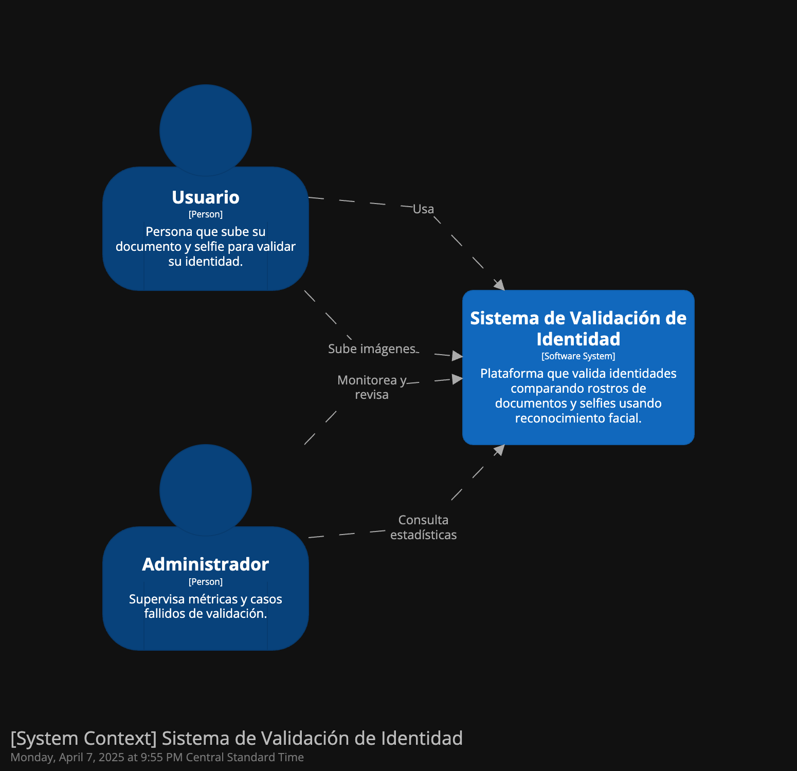
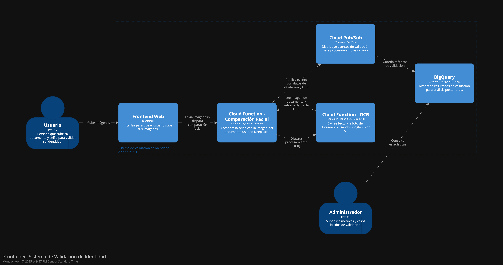

# 1. Introducción
## 1.1. Propósito
El propósito de este documento es describir detalladamente la arquitectura técnica del sistema de reconocimiento facial basado en Google Cloud Functions y DeepFace, con funcionalidades de extracción de texto desde imágenes, publicación de eventos en Google Pub/Sub y almacenamiento de datos en BigQuery. El propósito de la base de datos de BigQuery es llevar un registro detallado del conteo de transacciones por compañía. Este documento sirve como una guía técnica para todos los involucrados en el desarrollo, despliegue, mantenimiento y evolución del sistema.

### Audiencia Prevista

Este documento está dirigido a:

**Arquitectos de Software**: Para evaluar y validar las decisiones de arquitectura adoptadas, asegurando su alineación con los requisitos técnicos y de negocio.

**Desarrolladores**: Para comprender los componentes, patrones y tecnologías involucradas, así como las interfaces y dependencias del sistema.

**Ingenieros de DevOps**: Para facilitar la implementación, monitoreo, escalabilidad y mantenimiento de la infraestructura en la nube.

**Stakeholders de Negocio**: Para obtener una visión general del sistema y su alineación con los objetivos comerciales.

**Personal de Seguridad y Cumplimiento**: Para evaluar los aspectos relacionados con la seguridad, privacidad y conformidad regulatoria.

### Uso Previsto

Este documento debe ser utilizado como referencia técnica principal durante las fases de diseño, desarrollo, implementación y mantenimiento del sistema. Además, servirá como base para futuras mejoras y actualizaciones de la arquitectura, asegurando que cualquier cambio o extensión sea consistente con las decisiones previas y con la visión general del proyecto. Este documento es elaborado como parte del curso de Arquitectura de Software impartido por Cenfotec.

## 1.2 Alcance
El sistema que cubrirá esta arquitectura se enfoca en ofrecer un servicio de reconocimiento facial de alta disponibilidad y rendimiento mediante Google Cloud Functions con DeepFace, almacenamiento de resultados en BigQuery y comunicación asincrónica a través de Google Pub/Sub.

Las principales características incluyen:

**Procesamiento de Reconocimiento Facial en Tiempo Real**: Respuesta sub-second mediante Cloud Functions configuradas para escalar dinámicamente de acuerdo con la demanda.

**Extracción de Texto desde Imágenes**: Procesamiento de imágenes para extraer información textual relevante mediante Google Cloud AI, especialmente para identificar y extraer información de cédulas de las personas.

**Publicación de Eventos**: Uso de Google Pub/Sub para la comunicación asincrónica y desacoplamiento de componentes.

**Almacenamiento en BigQuery**: Registro de transacciones por compañía para análisis posterior.

El sistema debe ser capaz de manejar múltiples solicitudes concurrentes de manera eficiente, garantizando tiempos de respuesta sub-second incluso bajo cargas elevadas mediante la escalabilidad automática de las Cloud Functions.

## 1.3. Definiciones, Acrónimos y Abreviaturas
### 1.3.1 Definiciones
- **Reconocimiento Facial**: Técnica de identificación o verificación de la identidad de un individuo utilizando características biométricas extraídas de su rostro.
- **DeepFace**: Framework de código abierto basado en aprendizaje profundo (Deep Learning) que proporciona herramientas para análisis facial, incluyendo verificación de identidad, reconocimiento de emociones, edad y género.
- **Extracción de Texto (OCR)**: Proceso mediante el cual se convierte información textual presente en imágenes a un formato digital legible por máquina.
- **Google Cloud Pub/Sub**: Servicio de mensajería asíncrona proporcionado por Google Cloud que permite la comunicación entre aplicaciones a través de un modelo Publisher-Subscriber (Publicador-Suscriptor).
- **Google Cloud Functions**: Plataforma sin servidor que permite la ejecución de funciones en respuesta a eventos, como peticiones HTTP o mensajes de Pub/Sub.
- **Aprendizaje Profundo (Deep Learning)**: Rama de la Inteligencia Artificial que utiliza redes neuronales profundas para analizar grandes conjuntos de datos y aprender patrones complejos.
- **Red Neuronal Convolucional (CNN)**: Arquitectura de red neuronal comúnmente utilizada en tareas de visión por computadora como clasificación de imágenes y reconocimiento facial.
- **Endpoint**: Punto de acceso a un servicio o función expuesta a través de una URL para comunicación o procesamiento de datos.
- **Pipeline**: Conjunto de procesos secuenciales que transforman y transfieren datos de un estado inicial a uno final.
- **Microservicio**: Componente independiente que realiza una tarea específica dentro de una arquitectura más grande, comunicándose con otros servicios a través de APIs.
- **JSON (JavaScript Object Notation)**: Formato ligero de intercambio de datos fácil de leer y escribir para humanos, y fácil de interpretar y generar para máquinas.

### 1.3.2 Acrónimos y Abreviaturas
- AI: Artificial Intelligence (Inteligencia Artificial)
- CNN: Convolutional Neural Network (Red Neuronal Convolucional)
- DL: Deep Learning (Aprendizaje Profundo)
- OCR: Optical Character Recognition (Reconocimiento Óptico de Caracteres)
- API: Application Programming Interface (Interfaz de Programación de Aplicaciones)
- GCP: Google Cloud Platform
- HTTP: HyperText Transfer Protocol (Protocolo de Transferencia de Hipertexto)
- JSON: JavaScript Object Notation
- Pub/Sub: Publisher-Subscriber (Publicador-Suscriptor)
- ML: Machine Learning (Aprendizaje Automático)
- ID: Identification (Identificación)
- URL: Uniform Resource Locator (Localizador Uniforme de Recursos)
- REST: Representational State Transfer (Transferencia de Estado Representacional)

## 1.4. Referencias
Enumerar otros documentos, sitios web o materiales referenciados en este documento.

## 1.5. Resumen
Proporcionar un breve resumen de las secciones siguientes del documento.

# 2. Representación Arquitectónica 
## 2.1.Estilo Arquitectónico

El sistema implementa un estilo arquitectónico Basado en Microservicios Serverless desplegado principalmente en Google Cloud Platform (GCP). Cada componente del sistema es independiente y ejecuta una función específica, comunicándose a través de eventos y mensajes asincrónicos mediante Pub/Sub.

En este tipo de arquitectura, los servicios no están activos permanentemente, sino que se activan en respuesta a eventos específicos (ej. solicitudes de autenticación facial). Este modelo se integra de manera fluida con un ecosistema sin servidor (serverless), permitiendo escalabilidad automática y pago basado en uso real.

## 2.2 Justificación del Uso del Estilo Arquitectónico
**Modularidad y Escalabilidad:**

La arquitectura basada en microservicios permite que cada componente (Cloud Functions, Cloud Run, BigQuery, Cloud Vision AI, DeepFace) sea independiente, facilitando el desarrollo, despliegue y escalado individual.
En caso de un incremento de solicitudes de autenticación facial, los componentes involucrados pueden escalar automáticamente sin afectar otros servicios.

**Eficiencia de Costos:**

Serverless Computing ofrece un modelo de pago por uso real. Específicamente:
**Cloud Functions y Cloud Run:** Solo generan costos cuando se ejecutan, lo cual es ideal para procesos que se disparan por eventos o solicitudes (como las solicitudes de autenticación facial).

**BigQuery:** 
Facturado por consulta y almacenamiento, lo cual permite optimizar costos almacenando solo la información necesaria y accediéndola bajo demanda.

**Pub/Sub:** 
Bajo costo y eficiente para sistemas basados en eventos y comunicación asíncrona.
La naturaleza event-driven (basada en eventos) permite que el sistema permanezca inactivo cuando no hay solicitudes, eliminando costos de infraestructura asociados a servicios en constante ejecución.

**Elasticidad y Escalabilidad Automática:**
Google Cloud Functions y Cloud Run pueden escalar desde cero hasta miles de instancias automáticamente, respondiendo a la demanda sin necesidad de intervención manual o planificación previa.
Esto es crucial dado que la autenticación facial no es un proceso constante sino que responde a solicitudes esporádicas.

**Despliegue Simplificado y Alta Disponibilidad:**
Los servicios sin servidor proporcionan alta disponibilidad automáticamente, distribuyendo la carga y mejorando la tolerancia a fallos.
Este enfoque simplifica el despliegue continuo y la integración de nuevas funcionalidades sin afectar la operación de componentes ya existentes.

**Reducción de Costos de Mantenimiento:**
Al no gestionar servidores o infraestructura, se reduce significativamente el costo operativo y de mantenimiento.
Todo el monitoreo, actualización de parches de seguridad y escalabilidad son manejados automáticamente por Google Cloud.

# 3. Partes Interesadas y Preocupaciones del Sistema
## 3.1. Partes Interesadas

| Parte interesada           | Rol / Relación con el sistema                                       | Intereses / Preocupaciones clave |
|----------------------------|---------------------------------------------------------------------|---------------------------------------------------------------|
| **Usuarios finales**       | Personas que usan el sistema para validar su identidad.             | - Facilidad de uso  - Tiempo de respuesta rápido  - Privacidad y seguridad de sus imágenes - Confiabilidad del resultado |
| **Equipo de desarrollo**   | Encargados del diseño, desarrollo y mantenimiento del sistema.      | - Simplicidad y claridad de la arquitectura - Mantenibilidad del código - Facilidad para pruebas y despliegue |
| **Administradores del sistema** | Supervisa el comportamiento del sistema y los resultados de validación. | - Acceso a resultados de procesamiento - Trazabilidad de errores - Posibilidad de diagnóstico ante fallos |
| **Equipo de seguridad**    | Responsable de garantizar que el sistema cumpla con buenas prácticas de seguridad. | - Protección de los datos sensibles - Control de acceso a los recursos - Minimización del almacenamiento de datos |
| **Stakeholders de negocio**| Responsables de la viabilidad y sostenibilidad del sistema.         | - Bajo costo operativo - Escalabilidad del sistema - Tiempo de implementación rápido - Cumplimiento de objetivos funcionales |
| **Proveedor de infraestructura (GCP)** | Plataforma que ejecuta el sistema y provee los servicios gestionados. | - Uso correcto y eficiente de los recursos - Seguridad en la configuración de los servicios - Disponibilidad del entorno |

## 3.2. Preocupaciones del Sistema

| Categoría           | Preocupación del Sistema                                                        | Estrategia de Mitigación Propuesta                                     |
|---------------------|----------------------------------------------------------------------------------|------------------------------------------------------------------------|
| **Rendimiento**     | El sistema debe validar identidades en tiempo razonable, sin demoras perceptibles para el usuario. | Uso de funciones *serverless* (Cloud Functions) con procesamiento concurrente. Se espera < 3 segundos en el 95% de los casos. |
| **Escalabilidad**   | El sistema debe manejar picos de demanda sin degradación del servicio.          | Arquitectura basada en eventos y componentes *serverless* que escalan automáticamente (Cloud Functions, Pub/Sub). |
| **Seguridad**       | Protección de imágenes personales y datos sensibles durante el almacenamiento y procesamiento. | Uso de **Cloud Storage buckets privados**, encriptación en tránsito y en reposo, y acceso controlado mediante IAM. |
| **Privacidad**      | Protección de la identidad del usuario final.                                   | Eliminación automática de imágenes después de 24h, almacenamiento temporal, y cumplimiento con principios de minimización de datos. |
| **Costo**           | Optimización del uso de recursos para evitar costos innecesarios.               | Pago por uso con servicios *serverless* (solo se incurre en costos cuando hay actividad). No hay servidores siempre encendidos. |
| **Mantenibilidad**  | Facilidad para actualizar o extender el sistema sin afectar a los usuarios.     | Componentes desacoplados mediante Pub/Sub. Código modular en Python con funciones independientes. |
| **Auditoría y trazabilidad** | Posibilidad de auditar el flujo de validaciones, identificar errores o abusos. | Firestore guarda los eventos de validación. Todos los pasos clave se registran con timestamps. |
| **Disponibilidad**  | El sistema debe estar disponible 24/7, incluso ante fallos parciales.           | Infraestructura distribuida en GCP, servicios de alta disponibilidad y escalabilidad automática. |

# 4. Visión General del Sistema

## 4.1. Descripción de Alto Nivel

El sistema de **Validación de Identidad con Reconocimiento Facial** es una solución *serverless* desarrollada sobre Google Cloud Platform (GCP) que permite verificar la identidad de una persona comparando una selfie con una imagen de su documento de identidad.

La solución está diseñada para ser **escalable**, **segura** y **eficiente**, eliminando la necesidad de servidores dedicados y aprovechando servicios gestionados que se activan bajo demanda. Está compuesta por varios módulos funcionales que trabajan en conjunto para realizar las siguientes tareas:

### Funcionalidades principales:

- **Carga de imágenes:** El usuario sube dos imágenes: una de su documento de identidad y otra de su rostro (selfie).
- **Extracción de datos del documento:** A través de Google Vision AI (OCR), se extraen el texto y la fotografía del documento.
- **Comparación biométrica:** Se compara la imagen del documento con la selfie utilizando detección facial.
- **Determinación del resultado:** Se determina si la identidad es válida en base a un umbral de coincidencia facial.
- **Notificación al usuario:** Se notifica al usuario con el resultado de la validación.
- **Almacenamiento y trazabilidad:** Se guarda el resultado de la validación para auditoría y análisis posteriores.

### Componentes clave del sistema:

| Componente                     | Descripción                                                                 |
|--------------------------------|-----------------------------------------------------------------------------|
| **Google Cloud Storage (GCS)** | Almacena temporalmente las imágenes subidas por los usuarios.              |
| **Cloud Functions (Python)**   | Procesan cada etapa del flujo: carga, extracción OCR, comparación facial, etc. |
| **Google Vision AI**           | API que permite extraer texto y realizar detección facial en las imágenes. |
| **Cloud Pub/Sub**              | Facilita la comunicación asíncrona entre funciones para enviar notificaciones. |
| **Big Query**                  | Almacenamiento de registros de validación para análisis histórico.      |

Este enfoque modular permite que el sistema se adapte fácilmente a cambios o mejoras, manteniendo bajo control los costos operativos y asegurando un rendimiento óptimo.

# 5. Estrategias Arquitectónicas

## 5.1. Estrategias Clave

Las siguientes estrategias arquitectónicas se han definido para abordar de forma efectiva las preocupaciones de las partes interesadas, garantizando que el sistema sea escalable, seguro, eficiente y fácil de mantener:

### 1. **Arquitectura Serverless basada en eventos**
- Se utiliza Google Cloud Functions para construir un sistema reactivo y desacoplado.
- Las funciones se activan en respuesta a eventos (como la subida de una imagen o la finalización del procesamiento).
- **Preocupaciones abordadas**: escalabilidad, costos, rendimiento, mantenibilidad.

### 2. **Desacoplamiento mediante Cloud Pub/Sub**
- Se emplea Cloud Pub/Sub para comunicar funciones asíncronamente sin acoplamiento directo entre ellas.
- Esto permite escalar, distribuir carga y realizar tareas como el envío de notificaciones de forma independiente.
- **Preocupaciones abordadas**: escalabilidad, resiliencia, extensibilidad.

### 3. **Procesamiento inteligente con Google Vision AI y DeepFace**
- Se utiliza Google Vision AI para realizar OCR y detectar rostros en imágenes de documentos.
- Para la comparación facial entre la selfie y la imagen del documento, se emplea la librería DeepFace, que facilita la implementación de reconocimiento facial sin necesidad de construir modelos desde cero.
- Esta combinación permite integrar capacidades avanzadas de visión por computadora con simplicidad y rapidez de desarrollo.
- **Preocupaciones abordadas**: precisión de resultados, rendimiento, mantenimiento.

### 4. **No almacenamiento persistente de las imágenes en base de datos**
- Las imágenes subidas por los usuarios (documento y selfie) tienen un ciclo de vida muy corto: se procesan de inmediato y luego se eliminan.
- Evitar el almacenamiento permanente de imágenes o resultados ayuda a minimizar el riesgo de exposición de datos sensibles, alineándose con los principios de privacidad desde el diseño (privacy by design).
- Al eliminar componentes de almacenamiento persistente, se reducen los costos operativos y se eliminan dependencias adicionales.
- **Preocupaciones abordadas**: seguridad, privacidad, cumplimiento de normativas.

### 5. **Minimización del costo operativo**
- La arquitectura está basada en servicios gestionados y pago por uso.
- Se evita el aprovisionamiento de infraestructura o mantenimiento de servidores.
- **Preocupaciones abordadas**: eficiencia operativa, costos de infraestructura.

### 6. **Separación de responsabilidades y modularidad**
- Cada función realiza una tarea específica (subida, OCR, comparación, notificación).
- Se sigue el principio de responsabilidad única (SRP) para facilitar la mantenibilidad.
- **Preocupaciones abordadas**: mantenibilidad, extensibilidad, facilidad de pruebas.

# 6. Arquitectura del Sistema
## 6.1. Resumen de Capas/Módulos
Proporcionar un resumen de las capas o módulos del sistema.

## 6.2 Diagramas de Componentes
### 6.2.1 Vista general del sistema

### 6.2.2 Vista detallada del sistema

## 6.3 Diseño de la Base de Datos
No se utilizó una base de datos en el sistema ya que las imágenes y los resultados de validación se procesan de forma inmediata y no requieren persistencia. Esta decisión reduce la complejidad arquitectónica, minimiza los costos operativos y refuerza la privacidad del usuario al evitar el almacenamiento de datos sensibles. El enfoque se alinea con el modelo serverless y con principios de seguridad como la minimización de datos, ya que toda la información se maneja de manera efímera y se elimina una vez finalizado el procesamiento.

# 7. Decisiones Arquitectónicas Clave 
## 7.1. Registro de Decisiones
A continuación, se documentan las decisiones arquitectónicas más relevantes tomadas durante el diseño del sistema, junto con su justificación técnica y estratégica:

| Decisión Arquitectónica                                                                  | Justificación                                                                                                                        | Fecha       |
|------------------------------------------------------------------------------------------|--------------------------------------------------------------------------------------------------------------------------------------|-------------|
| Uso de Google Cloud Functions para los servicios de reconocimiento facial y extracción de texto. | Enfoque serverless para reducir costos operativos, facilitar el mantenimiento y escalar automáticamente.                            | 2025-03-01  |
| Integración con DeepFace para la verificación de identidad.                              | DeepFace ofrece un modelo preentrenado con alta precisión para verificación facial sin necesidad de entrenamiento personalizado.      | 2025-03-03  |
| Utilización de Cloud Vision AI para extracción de texto desde documentos.                | Vision AI permite obtener resultados OCR precisos para validar documentos como identificaciones.                                     | 2025-03-05  |
| Publicación de eventos en Google Pub/Sub para desacoplar el procesamiento posterior.     | Pub/Sub permite comunicación asincrónica, escalabilidad y tolerancia a fallos entre funciones y otros componentes.                   | 2025-03-07  |
| Almacenamiento de resultados en BigQuery como base de datos analítica principal.         | BigQuery facilita análisis de grandes volúmenes de datos para auditoría y métricas por compañía.                                     | 2025-03-08  |
| Exposición de funciones mediante HTTPS por defecto, sin servidores intermedios.          | Cloud Functions y Cloud Run en GCP usan TLS por defecto, cumpliendo requisitos de seguridad sin configuración adicional.             | 2025-03-10  |

### 7.1.1 Pros y Contras

En esta sección se analizan los principales beneficios y desafíos asociados a las decisiones arquitectónicas adoptadas en el diseño del sistema. Esta evaluación permite comprender los compromisos asumidos y las implicaciones técnicas, operativas y económicas del enfoque seleccionado.

#### Principales Ventajas (Pros)

- **Escalabilidad automática:** La adopción de componentes *serverless* como Cloud Functions y Cloud Run permite escalar de forma automática en función de la demanda, sin necesidad de administrar servidores.
- **Reducción de costos operativos:** Al pagar únicamente por el uso efectivo de los recursos, se optimiza el presupuesto, especialmente en escenarios de baja frecuencia de uso.
- **Desacoplamiento entre componentes:** El uso de Pub/Sub como middleware de eventos facilita la independencia entre funciones, favoreciendo el mantenimiento y la evolución de cada servicio de forma aislada.
- **Precisión en el reconocimiento facial:** DeepFace proporciona modelos robustos de verificación con alta confiabilidad, acelerando el desarrollo al evitar el entrenamiento desde cero.
- **Capacidades analíticas avanzadas:** BigQuery permite realizar análisis de grandes volúmenes de datos para obtener métricas detalladas por compañía y auditoría de eventos.

#### Principales Desventajas (Contras)

- **Tiempo de arranque en frío (cold start):** Las funciones serverless pueden experimentar ligeras demoras al iniciar cuando no han sido invocadas recientemente, afectando la experiencia en casos de baja latencia esperada.
- **Complejidad distribuida:** La separación funcional en múltiples servicios requiere mayor atención en la trazabilidad, monitoreo y manejo de errores.
- **Dependencia del ecosistema GCP:** La solución está altamente acoplada a servicios gestionados de Google, lo que puede limitar la portabilidad hacia otras nubes

### 7.1.2 Alternativas y Balance de Factores

Durante el proceso de definición arquitectónica, se consideraron diversas alternativas tecnológicas y de diseño que podrían haber satisfecho los requerimientos funcionales y no funcionales del sistema. A continuación, se detallan algunas de estas alternativas, junto con los factores que influyeron en la elección final.

#### Alternativas Evaluadas

- **Contenedores gestionados en GKE (Google Kubernetes Engine):**
  - *Ventaja:* Mayor control sobre los entornos de ejecución y configuración detallada del escalado.
  - *Desventaja:* Mayor complejidad operativa, necesidad de administración de clústeres y supervisión continua.

- **Uso de App Engine en lugar de Cloud Functions:**
  - *Ventaja:* Plataforma gestionada con soporte para aplicaciones web y backend completos.
  - *Desventaja:* Menor granularidad en la facturación y escalado más orientado a aplicaciones monolíticas.

- **Modelos personalizados de reconocimiento facial en Vertex AI:**
  - *Ventaja:* Posibilidad de entrenar modelos adaptados al dominio específico y mejorar la precisión.
  - *Desventaja:* Requiere dataset etiquetado, experiencia en ML, mayor tiempo de desarrollo y costos de entrenamiento.

- **Base de datos relacional en Cloud SQL en lugar de BigQuery:**
  - *Ventaja:* Mejor soporte para transacciones y consistencia fuerte.
  - *Desventaja:* Escalabilidad limitada y menor eficiencia en consultas analíticas sobre grandes volúmenes de datos.

#### Balance de Factores

La elección final se inclinó hacia una arquitectura basada en **componentes serverless desacoplados**, priorizando los siguientes factores:

- **Escalabilidad dinámica:** Uso de servicios que escalan automáticamente bajo demanda.
- **Simplicidad operativa:** Reducción de la carga de mantenimiento al eliminar la gestión de infraestructura.
- **Costo por uso:** Optimización presupuestaria al pagar solo por ejecución y almacenamiento consumido.
- **Velocidad de implementación:** Uso de servicios gestionados y bibliotecas preentrenadas que aceleran el desarrollo.
- **Cumplimiento de requisitos funcionales:** Satisfacción de necesidades específicas como verificación facial, OCR y registro por compañía.

Esta evaluación de alternativas permitió adoptar una solución equilibrada entre eficiencia técnica, mantenibilidad y control de costos.

### 7.1.3 Problemas Potenciales

Si bien la arquitectura adoptada ofrece múltiples beneficios en términos de escalabilidad, flexibilidad y costo, también existen riesgos y limitaciones inherentes al enfoque seleccionado. A continuación, se describen los problemas potenciales identificados que podrían afectar el rendimiento, la disponibilidad o la evolución del sistema:

#### 1. Latencia por arranque en frío (Cold Start)
Las funciones serverless, como Cloud Functions, pueden experimentar una latencia adicional cuando no han sido invocadas recientemente. Esto podría afectar la experiencia del usuario en escenarios donde se espera una respuesta inmediata.

#### 2. Complejidad en el monitoreo y trazabilidad
La naturaleza distribuida del sistema, con múltiples funciones y servicios desacoplados, puede dificultar la trazabilidad de errores y el análisis de logs. Es necesario implementar herramientas de observabilidad robustas como Cloud Logging, Cloud Trace y Cloud Monitoring.

#### 3. Límite en el tiempo de ejecución de funciones
Cloud Functions impone restricciones de tiempo (por ejemplo, 540 segundos en funciones HTTP), lo que podría ser un problema en escenarios donde el análisis facial o el procesamiento de imágenes sea más intensivo de lo previsto.

#### 4. Dependencia del ecosistema Google Cloud
El sistema está estrechamente ligado a servicios gestionados de GCP. Esto limita la portabilidad hacia otras plataformas cloud o entornos on-premise, generando una dependencia tecnológica (vendor lock-in).

#### 5. Gestión de versiones y despliegue simultáneo
Las actualizaciones simultáneas de múltiples funciones o servicios podrían generar inconsistencias si no se controla correctamente el versionado, especialmente en un entorno altamente desacoplado.

#### 6. Escalabilidad descontrolada
Aunque la escalabilidad automática es una ventaja clave, también puede llevar a un consumo inesperado de recursos y costos si no se implementan mecanismos adecuados de control, como límites de concurrencia o alertas presupuestarias.

Es fundamental anticiparse a estos problemas potenciales mediante una planificación adecuada, la implementación de buenas prácticas de DevOps y la adopción de mecanismos de resiliencia y monitoreo proactivo.

### 7.1.4 Dependencias a Considerar

El correcto funcionamiento del sistema de reconocimiento facial depende de una serie de servicios, bibliotecas y configuraciones externas que deben ser gestionadas y monitoreadas cuidadosamente. A continuación se detallan las principales dependencias técnicas a considerar:

#### 1. Servicios de Google Cloud Platform (GCP)

- **Cloud Functions:** Ejecución de lógica de reconocimiento facial y extracción de texto. Su disponibilidad y rendimiento son críticos para el sistema.
- **Cloud Vision AI:** Servicio de OCR utilizado para extraer texto de documentos de identidad. Cualquier cambio en su API o en sus políticas de uso afectaría directamente esta funcionalidad.
- **Cloud Pub/Sub:** Mecanismo de mensajería utilizado para desacoplar componentes. Su correcta configuración garantiza la entrega de eventos entre funciones.
- **BigQuery:** Almacenamiento y análisis de datos transaccionales por compañía. Depende de esquemas bien definidos y control de costos por uso de consultas.
- **Cloud Run (opcional):** Si se utiliza para exponer la interfaz de autenticación, debe contar con configuración adecuada de recursos, escalado y seguridad.

#### 2. Bibliotecas y Frameworks

- **DeepFace:** Biblioteca de Python para verificación facial. Su compatibilidad con futuras versiones de Python o dependencias de OpenCV debe monitorearse activamente.
- **OpenCV y NumPy:** Utilizados para procesamiento de imágenes. Son componentes esenciales en el preprocesamiento de datos visuales.
- **Flask / Functions Framework:** Framework de desarrollo para exponer endpoints HTTP. Cambios en sus versiones podrían afectar el comportamiento del backend.

#### 3. Configuraciones de Seguridad e IAM

- **Cuentas de servicio (Service Accounts):** Cada función debe tener asignado el rol mínimo necesario para interactuar con los recursos de GCP.
- **HTTPS y políticas CORS:** Deben garantizarse para la protección de datos sensibles transmitidos entre cliente y backend.

#### 4. Entorno de Ejecución

- **Versión de Python soportada por Cloud Functions:** La biblioteca DeepFace y otros módulos deben ser compatibles con la versión de Python configurada en el entorno de ejecución.
- **Cuotas y límites de GCP:** Es necesario supervisar los límites de ejecución, almacenamiento y concurrencia para evitar interrupciones del servicio.

Estas dependencias deben ser revisadas periódicamente y gestionadas mediante herramientas de automatización, validación de versiones y monitoreo continuo para asegurar la estabilidad y evolución del sistema.

# 8. Atributos de Calidad 
## 8.1. Rendimiento
### Requisitos de rendimiento

- **Tiempo máximo de respuesta:** El sistema debe procesar la verificación facial (recepción de imágenes, análisis con DeepFace y validación de identidad) en menos de 2 segundos en el 95% de los casos.
- **Tiempo máximo de extracción de texto:** El OCR de la identificación debe ejecutarse en menos de 1 segundo.
- **Concurrencia esperada:** El sistema debe manejar hasta 500 solicitudes simultáneas en horas pico sin degradar el rendimiento.
- **Tolerancia al arranque en frío:** Las funciones críticas deben minimizar el impacto del cold start mediante estrategias como precalentamiento o instancias mínimas en Cloud Run.

### Soporte desde la arquitectura

La arquitectura propuesta respalda estos requisitos de rendimiento mediante las siguientes decisiones:

- **Asignación de recursos generosos por función:** Cada Cloud Function está configurada con **8 GB de memoria y 2 CPUs**, optimizando el procesamiento intensivo de imágenes requerido por DeepFace y Vision AI.
- **Escalado controlado por concurrencia:** Las funciones están limitadas a **un máximo de 10 instancias simultáneas**, lo cual permite controlar el uso de recursos y evitar un escalado descontrolado que pueda afectar la estabilidad del sistema o generar costos inesperados.
- **Separación de responsabilidades:** La arquitectura desacopla la extracción de texto y la verificación facial en funciones independientes, permitiendo ejecución paralela y evitando cuellos de botella.
- **Procesamiento asincrónico con Pub/Sub:** Las tareas no críticas se gestionan mediante mensajería, lo que reduce la carga en el flujo de autenticación.
- **Almacenamiento en BigQuery fuera del tiempo real:** Las inserciones de datos analíticos se procesan fuera del flujo principal, minimizando la latencia percibida por el usuario.
- **Despliegue geolocalizado:** Las funciones se alojan en regiones de GCP cercanas a los usuarios objetivo del banco para reducir la latencia de red.

Gracias a esta configuración, el sistema está diseñado para cumplir con los exigentes niveles de rendimiento requeridos por instituciones financieras, garantizando autenticaciones seguras y ágiles para cada transacción crítica.

## 8.2. Escalabilidad

### Escenario hipotético

Nuestra arquitectura pretende abarcar sistemas de seguridad financieros y planea ampliar progresivamente el uso del sistema de autenticación facial, pasando de un piloto interno a una implementación a nivel nacional para todos los usuarios de banca en línea y móvil. Esto implica una proyección de crecimiento de usuarios activos desde 5.000 hasta más de 100.000 en un plazo de 12 meses, con picos de actividad en horarios bancarios y durante fechas de alto volumen transaccional (como quincenas o pagos de impuestos).

### Consideraciones de escalabilidad

- **Crecimiento en número de usuarios:** El sistema debe poder atender un aumento sostenido y abrupto de usuarios sin reconfiguraciones mayores.
- **Carga variable según horarios:** Se espera una distribución de carga desigual, con horas pico que exigen mayor capacidad de procesamiento.
- **Escalado por función:** Cada componente debe escalar independientemente según su demanda específica (por ejemplo, verificación facial vs. extracción de texto).
- **Control presupuestario:** La escalabilidad debe estar balanceada con límites que eviten costos descontrolados por autoescalado excesivo.

### Estrategias de escalabilidad implementadas

- **Arquitectura basada en funciones serverless:** Cloud Functions y Cloud Run permiten escalar horizontalmente de forma automática según la demanda, sin necesidad de aprovisionar infraestructura de antemano.
- **Configuración de escalado controlado:** Se ha definido un límite de **10 instancias simultáneas por función**, lo cual brinda un punto de control sobre la escalabilidad y los costos. Esta configuración puede ajustarse según el comportamiento observado en producción.
- **Separación de cargas críticas y no críticas:** Las operaciones no esenciales (como almacenamiento en BigQuery) se gestionan asincrónicamente con Pub/Sub, permitiendo priorizar los recursos para las funciones de autenticación en tiempo real.
- **Paralelismo entre funciones desacopladas:** Al dividir los procesos en funciones independientes (OCR, verificación facial, logging), se facilita el escalado independiente por carga.
- **Monitoreo y alertamiento proactivo:** Se utilizan herramientas como Cloud Monitoring y Cloud Logging para observar métricas clave y escalar de manera anticipada ante tendencias de alta demanda.

---

Gracias a estas estrategias, el sistema está preparado para escalar de manera controlada y eficiente, adaptándose a las necesidades cambiantes del merdado financiero sin comprometer la disponibilidad ni el rendimiento, y manteniendo el control sobre el consumo de recursos y costos operativos.

## 8.3. Seguridad

Dado que el sistema es pretende ser utilizado para autenticar transacciones bancarias de alto valor, la arquitectura debe cumplir con estrictos requisitos de seguridad para proteger los datos biométricos y personales de los usuarios, así como garantizar que los accesos a los servicios estén debidamente controlados y auditados.

### Medidas de seguridad implementadas

#### 1. Autenticación y autorización mediante OAuth 2.0

Las Cloud Functions están configuradas para aceptar únicamente solicitudes autenticadas y autorizadas a través del protocolo **OAuth 2.0** de Google. Esto permite que solo usuarios o servicios previamente autorizados puedan acceder a los endpoints expuestos, reduciendo significativamente el riesgo de accesos no autorizados.

#### 2. Restricción de acceso mediante VPCs privadas

Todas las funciones críticas del sistema están desplegadas dentro de **redes privadas (VPCs)** de Google Cloud. Esto significa que no son accesibles públicamente por defecto, y que solo los servicios y aplicaciones explícitamente habilitados dentro del mismo entorno de red pueden comunicarse con ellas. Esta medida mitiga ataques de tipo externo y evita exposición innecesaria de la lógica sensible del sistema.

#### 3. Cifrado en tránsito con HTTPS

La comunicación entre clientes (por ejemplo, la app móvil del banco) y las Cloud Functions se realiza exclusivamente sobre **HTTPS**, que es el protocolo por defecto en los servicios serverless de Google. Esto garantiza que todos los datos —incluyendo imágenes biométricas y resultados de autenticación— estén **cifrados en tránsito**, protegiendo la integridad y confidencialidad frente a ataques de intermediarios (Man-in-the-Middle).

#### 4. Principio de mínimo privilegio

Cada función cuenta con una cuenta de servicio independiente y **roles de IAM específicos y restringidos**. Esto asegura que cada componente del sistema tenga acceso únicamente a los recursos estrictamente necesarios, evitando escalamiento de privilegios y mejorando la auditabilidad.

#### 5. Auditoría y trazabilidad

Todas las llamadas a las funciones, accesos a recursos y errores relevantes se registran en **Cloud Logging** y pueden ser auditados posteriormente. Esto permite detectar patrones sospechosos, identificar incidentes de seguridad y generar reportes de cumplimiento normativo.

Estas medidas permiten que el sistema cumpla con los estándares de seguridad esperados en el sector bancario, garantizando la protección de los datos sensibles de los usuarios, la confidencialidad de las transacciones y la integridad operativa del sistema.

## 8.4. Mantenibilidad

### Escenario hipotético

Dado que el sistema es utilizado para autenticaciones biométricas en transacciones críticas, la arquitectura debe facilitar la detección temprana de errores, actualizaciones seguras y una rápida recuperación ante fallos. El mantenimiento eficiente es clave para garantizar la continuidad operativa del banco sin interrupciones para los usuarios finales.

### Estrategias de diseño para la mantenibilidad

#### 1. Repositorio centralizado y modularidad del código

Todo el código fuente del sistema está escrito en **Python** y mantenido en un repositorio único y versionado en **GitHub**. Las funciones están organizadas modularmente, lo que facilita la lectura, pruebas y modificación de componentes individuales sin afectar el sistema completo.

#### 2. Integración continua y despliegue automatizado

Se ha implementado un **pipeline CI/CD** utilizando **GitHub Actions**, que automatiza las siguientes tareas al realizar cambios en la rama `main`:

- Construcción de contenedores para las funciones.
- Ejecución de pruebas unitarias y de integración.
- Análisis estático de código para garantizar calidad y cumplimiento de estándares.
- Despliegue automatizado en el entorno de producción de Google Cloud Platform (GCP), únicamente si todas las etapas previas se completan exitosamente.

#### 3. Implementación gradual y reversión de versiones

Cada despliegue de Cloud Functions está configurado para:

- **Asignar gradualmente tráfico** a la nueva versión (por ejemplo, 10% al inicio), permitiendo validación en producción con bajo impacto.
- **Revertir fácilmente** a la versión anterior en caso de errores críticos detectados post-despliegue, utilizando las capacidades de versionado nativo de Cloud Functions.

#### 4. Ambientes diferenciados para pruebas

Se cuenta con un **ambiente de testing aislado** (proyecto independiente en GCP), en el cual se pueden desplegar nuevas versiones del sistema y probar funcionalidades sin afectar a los usuarios reales ni comprometer datos sensibles.

#### 5. Observabilidad y monitoreo continuo

La integración con **Cloud Logging**, **Error Reporting** y **Cloud Monitoring** permite detectar de forma temprana fallos, analizar patrones de error, y recibir alertas en tiempo real que facilitan el diagnóstico y resolución ágil de incidencias.

Gracias a estas prácticas, el sistema de autenticación biométrica está diseñado para ser altamente mantenible, reduciendo tiempos de respuesta ante fallos, minimizando el riesgo de regresiones y facilitando la evolución continua de la solución sin interrumpir la operación bancaria.

# 9. Riesgos y Deuda Técnica 
## 9.1. Riesgos Identificados

En esta sección se enumeran los principales riesgos técnicos y operativos identificados durante el diseño del sistema de autenticación facial. Se evalúa su posible impacto sobre la seguridad, disponibilidad, desempeño y continuidad del servicio en el contexto del entorno bancario.

| Riesgo                                         | Descripción                                                                                         | Impacto Potencial                                     | Nivel de Riesgo |
|-----------------------------------------------|-----------------------------------------------------------------------------------------------------|--------------------------------------------------------|-----------------|
| Fallo en el reconocimiento facial             | DeepFace puede fallar en condiciones de baja calidad de imagen, iluminación deficiente o diversidad facial. | Rechazo de transacciones legítimas, mala UX.          | Alto            |
| Latencia por cold start en funciones          | Cloud Functions pueden tardar en responder si no han sido invocadas recientemente.                  | Afecta la experiencia del usuario final.               | Medio           |
| Dependencia del ecosistema GCP                | Alta dependencia de servicios gestionados de Google.                                                | Difícil migración o continuidad fuera de GCP.          | Alto            |
| Escalabilidad descontrolada en horas pico     | Uso intensivo podría generar consumo inesperado de recursos.                                        | Costos elevados y posible saturación.                  | Medio           |
| Fallo en el pipeline de despliegue automático | Error en GitHub Actions podría desplegar versiones defectuosas o interrumpir actualizaciones.       | Degradación del servicio o downtime.                   | Alto            |
| Fuga o acceso no autorizado a datos sensibles | Riesgo de exposición de imágenes biométricas o datos personales por errores de configuración.       | Incumplimiento regulatorio y pérdida de confianza.     | Crítico         |
| Cambios en las APIs de servicios externos (Vision AI, DeepFace) | Alteraciones en APIs podrían romper funcionalidades clave.                                         | Interrupción del servicio o errores silenciosos.       | Medio           |
| Baja cobertura de pruebas en nuevas versiones | Ausencia de pruebas automatizadas adecuadas en funciones nuevas.                                   | Introducción de bugs en producción.                    | Alto            |
| Configuraciones incorrectas de IAM o VPC      | Roles mal asignados o acceso a red inadecuado.                                                     | Exposición a amenazas externas.                        | Alto            |

La identificación temprana de estos riesgos permite establecer planes de mitigación y contingencia para garantizar la estabilidad y seguridad del sistema ante escenarios adversos.

## 9.2. Deuda Técnica

Durante el desarrollo inicial del sistema de autenticación biométrica se han identificado algunas áreas donde, por restricciones de tiempo o priorización de funcionalidades críticas, no se logró alcanzar el nivel óptimo de calidad técnica. Estas situaciones representan **deuda técnica** que deberá ser gestionada en futuras iteraciones para garantizar la sostenibilidad y escalabilidad del sistema a largo plazo.

### Áreas identificadas de deuda técnica

| Área                                          | Descripción                                                                                         | Riesgo asociado                                      | Plan de resolución                                           |
|-----------------------------------------------|-----------------------------------------------------------------------------------------------------|------------------------------------------------------|--------------------------------------------------------------|
| Pruebas automatizadas incompletas             | Algunas funciones críticas carecen de cobertura de pruebas unitarias y de integración.              | Introducción de errores en producción.               | Implementar pruebas con PyTest. Estimado: Sprint 3.          |
| Validaciones limitadas en entradas            | El sistema no realiza validaciones profundas sobre las imágenes o metadatos recibidos.              | Procesamiento erróneo o fallos silenciosos.          | Agregar validaciones y manejo robusto de errores. Sprint 4.  |
| Monitoreo parcial de métricas                 | Falta de métricas personalizadas (tiempos de respuesta, errores por tipo).                         | Baja visibilidad para diagnóstico y ajuste.          | Incorporar métricas con Cloud Monitoring. Sprint 5.          |
| Gestión manual de roles IAM                   | Algunos permisos aún se asignan de forma manual.                                                   | Configuraciones inseguras o privilegios innecesarios.| Automatizar con Terraform. Sprint 6.                         |
| Falta de pruebas de carga                     | No se ha evaluado el sistema bajo condiciones reales de alta concurrencia.                          | Falla bajo demanda intensiva.                        | Pruebas con Locust o k6. Sprint 7.                           |
| Implementación pendiente de VPC               | El sistema aún no ha sido migrado a una red privada.                                                | Exposición innecesaria de endpoints.                 | Configurar VPC y control de acceso. Sprint 2.                |
| Ausencia de dashboard para administración     | No se cuenta con una interfaz para que administradores visualicen casos o monitoreen eventos.       | Limitada gestión operativa y auditoría.              | Diseñar e implementar panel web seguro. Sprint 8.            |
| Falta de sistema de revisión manual de casos  | No hay mecanismo para revisión humana en casos donde el reconocimiento falle o sea dudoso.          | Riesgo de falsos positivos o bloqueo de usuarios.     | Integrar flujo de revisión manual vía dashboard. Sprint 9.   |
| Almacenamiento persistente de identificaciones| Actualmente, los usuarios deben subir su ID en cada autenticación.                                 | Mala experiencia de usuario, uso innecesario de recursos. | Implementar sistema de almacenamiento seguro con cifrado. Sprint 10. |

La deuda técnica es monitoreada activamente y documentada como parte del backlog del equipo de desarrollo. Su resolución forma parte del plan de mejora continua y de los objetivos estratégicos de madurez operativa y experiencia de usuario para “Financiera Segura S.A.”.

# 10. Apéndices 
## 10.1. Glosario

Para consultar las definiciones clave de los términos técnicos utilizados en este documento, refiérase a la sección **1.3. Definiciones, Acrónimos y Abreviaturas**. Esta sección contiene la descripción de conceptos como:

- **Cloud Function**
- **Pub/Sub**
- **BigQuery**
- **OCR (Reconocimiento Óptico de Caracteres)**
- **DeepFace**
- **OAuth 2.0**
- **VPC (Virtual Private Cloud)**
- **Pipeline CI/CD**
- **Cold Start**
- **Autenticación Biométrica**

Estas definiciones ayudan a garantizar una comprensión común entre todos los equipos técnicos y no técnicos involucrados en el desarrollo, operación y mantenimiento del sistema.

---

## 10.2. Índice

A continuación se presenta un índice de secciones y términos clave incluidos en el documento, con el objetivo de facilitar su navegación y consulta:

### Secciones principales

## Índice del Documento

- [1. Introducción](#1-introducción)
  - [1.1. Propósito](#11-propósito)
    - [Audiencia Prevista](#audiencia-prevista)
    - [Uso Previsto](#uso-previsto)
  - [1.2 Alcance](#12-alcance)
  - [1.3. Definiciones, Acrónimos y Abreviaturas](#13-definiciones-acrónimos-y-abreviaturas)
    - [1.3.1 Definiciones](#131-definiciones)
    - [1.3.2 Acrónimos y Abreviaturas](#132-acrónimos-y-abreviaturas)
  - [1.4. Referencias](#14-referencias)
  - [1.5. Resumen](#15-resumen)
- [2. Representación Arquitectónica](#2-representación-arquitectónica)
  - [2.1. Estilo Arquitectónico](#21estilo-arquitectónico)
  - [2.2. Justificación del Uso del Estilo Arquitectónico](#22-justificación-del-uso-del-estilo-arquitectónico)
- [3. Partes Interesadas y Preocupaciones del Sistema](#3-partes-interesadas-y-preocupaciones-del-sistema)
  - [3.1. Partes Interesadas](#31-partes-interesadas)
  - [3.2. Preocupaciones del Sistema](#32-preocupaciones-del-sistema)
- [4. Visión General del Sistema](#4-visión-general-del-sistema)
  - [4.1. Descripción de Alto Nivel](#41-descripción-de-alto-nivel)
    - [Funcionalidades principales](#funcionalidades-principales)
    - [Componentes clave del sistema](#componentes-clave-del-sistema)
- [5. Estrategias Arquitectónicas](#5-estrategias-arquitectónicas)
  - [5.1. Estrategias Clave](#51-estrategias-clave)
    - [1. Arquitectura Serverless basada en eventos](#1-arquitectura-serverless-basada-en-eventos)
    - [2. Desacoplamiento mediante Cloud Pub/Sub](#2-desacoplamiento-mediante-cloud-pubsub)
    - [3. Procesamiento inteligente con Google Vision AI y DeepFace](#3-procesamiento-inteligente-con-google-vision-ai-y-deepface)
    - [4. No almacenamiento persistente de las imágenes en base de datos](#4-no-almacenamiento-persistente-de-las-imágenes-en-base-de-datos)
    - [5. Minimización del costo operativo](#5-minimización-del-costo-operativo)
    - [6. Separación de responsabilidades y modularidad](#6-separación-de-responsabilidades-y-modularidad)
- [6. Arquitectura del Sistema](#6-arquitectura-del-sistema)
  - [6.1. Resumen de Capas/Módulos](#61-resumen-de-capasmódulos)
  - [6.2. Diagramas de Componentes](#62-diagramas-de-componentes)
    - [6.2.1 Vista general del sistema](#621-vista-general-del-sistema)
    - [6.2.2 Vista detallada del sistema](#622-vista-detallada-del-sistema)
  - [6.3. Diseño de la Base de Datos](#63-diseño-de-la-base-de-datos)
- [7. Decisiones Arquitectónicas Clave](#7-decisiones-arquitectónicas-clave)
  - [7.1. Registro de Decisiones](#71-registro-de-decisiones)
    - [7.1.1 Pros y Contras](#711-pros-y-contras)
    - [7.1.2 Alternativas y Balance de Factores](#712-alternativas-y-balance-de-factores)
    - [7.1.3 Problemas Potenciales](#713-problemas-potenciales)
    - [7.1.4 Dependencias a Considerar](#714-dependencias-a-considerar)
- [8. Atributos de Calidad](#8-atributos-de-calidad)
  - [8.1. Rendimiento](#81-rendimiento)
  - [8.2. Escalabilidad](#82-escalabilidad)
  - [8.3. Seguridad](#83-seguridad)
  - [8.4. Mantenibilidad](#84-mantenibilidad)
- [9. Riesgos y Deuda Técnica](#9-riesgos-y-deuda-técnica)
  - [9.1. Riesgos Identificados](#91-riesgos-identificados)
  - [9.2. Deuda Técnica](#92-deuda-técnica)
- [10. Apéndices](#10-apéndices)
  - [10.1. Glosario](#101-glosario)
  - [10.2. Índice](#102-índice)
  - [10.3. Historial de Revisión](#103-historial-de-revisión)

### Términos clave

- **Autenticación biométrica**
- **Cloud Function**
- **DeepFace**
- **OCR**
- **BigQuery**
- **OAuth 2.0**
- **CI/CD**
- **VPC**
- **Cold Start**
- **Pipeline**
- **Serverless**
- **GCP (Google Cloud Platform)**

## 10.3. Historial de Revisión

A continuación se detalla el historial de revisiones del presente documento, con el objetivo de mantener un registro transparente de los cambios realizados a lo largo del tiempo:

| Versión | Fecha       | Descripción                                                                 | Autor(es)                                  |
|---------|-------------|------------------------------------------------------------------------------|--------------------------------------------|
| 0.1     | 2025-02-17  | Versión inicial del documento.                                              | Joan Armando Carballo                      |
| 0.2     | 2025-03-04  | Se agregan diagramas de arquitectura y detalle de componentes.              | Joan Armando Carballo, Jairo Bonilla       |
| 0.3     | 2025-03-19  | Inclusión de atributos de calidad, decisiones arquitectónicas y riesgos.    | Joan Armando Carballo, Jairo Bonilla       |
| 1.0     | 2025-04-18  | Versión consolidada final con índice, glosario, historial y control de cambios. | Joan Armando Carballo, Jairo Bonilla    |

